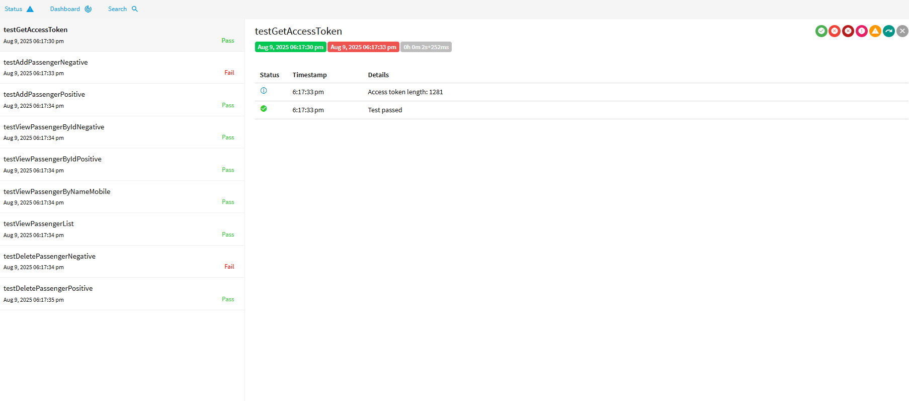

# FlightBookingApiRestAssured

**API Automation Framework with Rest Assured + TestNG + ExtentReports**

---

## 📌 Overview

FlightBookingApiRestAssured is a robust, Maven-based automation framework designed to test the Flight Booking Passenger Service API (imported from your Postman collection).  
It leverages **Java**, **Rest Assured**, **TestNG**, and **ExtentReports** for seamless API automation and detailed reporting.

---

## 📂 Project Structure

```
FlightBookingApiRestAssured/
│
├── pom.xml                        # Maven dependencies and build configuration
├── testng.xml                     # TestNG suite configuration
├── README.md                      # Project documentation
│
├── src/
│   ├── main/java/utils            # Utility classes
│   ├── test/java/base             # Base classes & reporting setup
│   ├── test/java/pojo             # POJOs (data models)
│   ├── test/java/tests            # API test classes
│   └── test/resources             # Configurations & test data
│
└── target/                        # Compiled classes & generated reports
```

---

## ⚙️ Setup & Installation

### 1️⃣ Prerequisites

- Java 11 or higher
- Maven 3.6+
- Internet access to connect with API endpoints

### 2️⃣ Clone the Repository

```bash
git clone https://github.com/your-org/FlightBookingApiRestAssured.git
cd FlightBookingApiRestAssured
```

### 3️⃣ Configure Environment

Update `src/test/resources/config.properties` with your environment details:

```properties
baseUrl=https://webapps.tekstac.com/TrainAPI/PassengerService
authUrl=https://keycloak.tekstac.com/realms/soapdemo/protocol/openid-connect/token
client_id=soap-test
client_secret=tE2HfYI5z4BhX7R8pimTrxzMLsueUG27
reportDir=target/ExtentReports
```

---

## ▶️ Running Tests

To execute all tests, simply run:

```bash
mvn clean test
```

---

## 📊 Reports

After test execution, view the detailed Extent HTML Report at:

```
target/ExtentReports/FlightBookingApiTestReport.html
```
  


---

## ✅ Features

- **Token-based Authentication** using Keycloak (client_credentials flow)
- **Data-driven testing** with JSON payloads
- **Covers Positive & Negative test scenarios**
- **Modular design:** Utilities, base classes, POJOs, and tests are well separated
- **Custom HTML Reports** with ExtentReports
- **TestNG-based** test orchestration

---

## 🔄 Extending the Framework

**To add new API tests:**
- Create a class under `src/test/java/tests`
- Extend `TestBase`
- Use `TokenManager.getAccessToken()` for authentication

**To add new payloads:**
- Place your JSON files under `src/test/resources/testdata`
- Load them using: `PayloadBuilder.loadJsonAsMap("testdata/filename.json")`

**Environment Profiles (optional):**
- Add additional `.properties` files (e.g., `config.qa.properties`, `config.dev.properties`)
- Load appropriate configs using Maven profiles

---